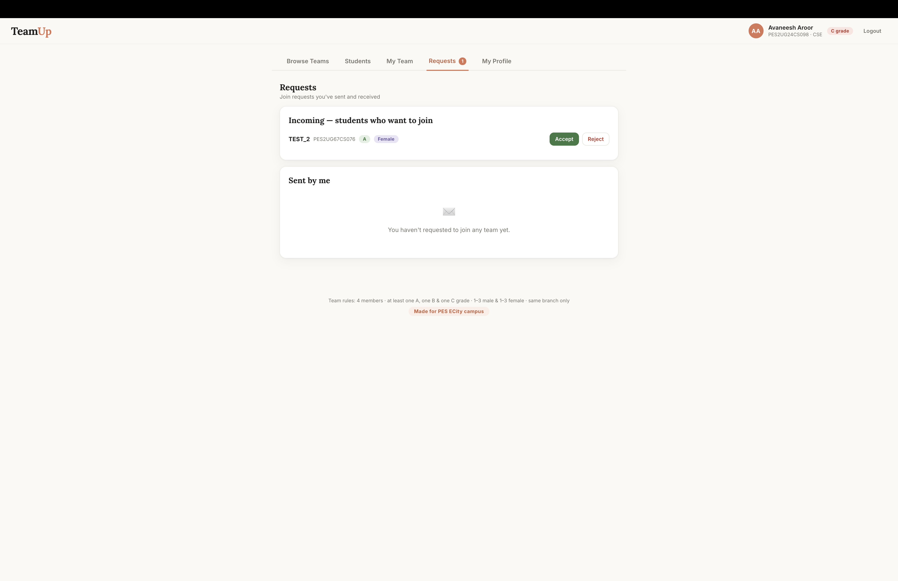

# TeamUp 🎓

**A team formation portal for BTech capstone projects — made for PES Electronic City campus.**

Every 3rd-year student needs a team of 4 for the two-year capstone project, and the
university has strict rules about who can team up with whom. Finding teammates over
WhatsApp is chaos — TeamUp replaces it with a clean portal where the rules are
enforced automatically and finding the *right* teammates is actually easy.

Built by [Avaneesh Aroor](https://github.com/avaneesh1830).

---

## Screenshots

| Login | Register |
|---|---|
|  |  |

| Browse Teams (with filters) | My Team (mentor picker) |
|---|---|
|  |  |

| Join Requests | My Profile |
|---|---|
|  |  |

---

## Features

### 🧩 Team formation with rules enforced automatically
- Teams of **exactly 4 members** — the system makes an invalid team impossible:
  - grade mix (A = CGPA 8+, B = 7–8, C = <7) must be one of the allowed combinations:
    **AABC, ABBC, ABCC, AACC, BBCC**
  - mixed-gender teams are **preferred but not required** — all-male / all-female teams are allowed
  - **CSE and AIML students can combine** in one team; ECE teams are ECE-only —
    incompatible joins are blocked with a clear error
- The team creator becomes **leader** 👑 and approves or rejects join requests
- Every team card shows exactly **which grade slots are still open**, computed live
  (e.g. a team with A+A+B can only take a C — anything else would break the allowed combos)
- Rules are re-checked at accept time too, so stale requests can't sneak in

### 🔎 Finding the right teammates
- **Browse Teams** — every team with its members, open slots, and one-click join requests
- **Filters** — by branch, project domain, open grade slot, and open gender slot,
  with a live "3 of 7 teams" count
- **Student directory** — search any classmate by name or SRN, see whether they're
  available or already in a team, and **request to join their team right from the
  search result**; leaders also see instantly whether a searched student is eligible
  for their team
- **Project showcase** — every student can list projects they've worked on
  (title, description, link), expandable from any team card or join request
- **Personal GitHub** — each member's GitHub appears as a chip next to their name
- **Member introductions** — every team member writes their own "what I've worked on"
  blurb on the team page; the server only ever writes to the author's own entry,
  so nobody can edit anyone else's

### 🎯 Project domains
- Teams are organised around their **project domain** (AI/ML, Web Dev, IoT,
  Cybersecurity, Blockchain, …) — pick from a dropdown or type a custom one

### 👨‍🏫 Faculty mentors
- Leaders pick a mentor from the real **PES EC-campus faculty directory** —
  85 professors from CSE, AIML, and ECE with names, designations, and photos
- Searchable picker with large photos; mentor is displayed on the team's public card
- Can be chosen at creation time or any time later, and changed or removed

### 🔐 Privacy, accountability & safety
- **Exact CGPA is never shown to other students** — only the grade letter (A/B/C)
- Passwords stored with **salted scrypt hashing**; sessions via bearer tokens
- Students can **edit their own details** (with team-rule re-validation so an edit
  can't silently break an existing team) and **delete their account**
- Built-in **activity log** records every registration, team creation, join,
  leave, and disband with timestamps
- All user content is HTML-escaped; all links validated server-side

### ⚡ Built to handle the whole batch
- Load-tested with **1,600 students and 350 teams**: 20–40ms per request,
  200 concurrent requests (a signup-deadline traffic spike) served within ~3s
- gzip compression (the teams payload shrinks ~12×)
- SQLite with WAL mode: ACID transactions and indexed queries — verified
  crash-safe with a `kill -9` mid-write, restarted with zero data loss

---

## Tech stack

- **Backend:** Node.js + Express — a single ~900-line server, no separate database server to run
- **Storage:** **SQLite** (`teamup.db`) via `better-sqlite3` — a real relational database
  that lives as one file, same operational simplicity as before but with ACID
  transactions, indexes, and standard SQL underneath. `DATA_DIR` env var points
  it at a persistent volume. See [`db.js`](db.js) for the schema and data-access layer.
- **Frontend:** vanilla HTML/CSS/JS — no framework, no build step
- **Faculty data:** scraped from [staff.pes.edu](https://staff.pes.edu/atoz/); mentor directory
  parsed from the official faculty-domains sheet into `mentors.json`

### Why SQLite, not MongoDB

- **No separate server to host** — it's a file, not a service, so there's nothing extra
  for college IT to install, expose a port for, or maintain (the exact operational
  overhead that ruled out running a MongoDB server here)
- **Real relational SQL** — proper tables, foreign keys, joins, ACID transactions —
  the standard model, not a bespoke format
- **Portable further** — SQLite exports directly to MySQL/PostgreSQL with zero
  data-model rework if the college ever wants a full client-server RDBMS instead

## Run it locally

You need [Node.js](https://nodejs.org) installed. Then:

```bash
git clone https://github.com/avaneesh1830/TeamUp.git
cd TeamUp
npm install
npm start
```

Open http://localhost:3000. Data lives in `teamup.db` (auto-created; delete to reset).

If you're upgrading from an older copy that used `data.json`, run the one-time
migration first: `node migrate-json-to-sqlite.js` (safe to run once; it won't
overwrite an already-populated `teamup.db`).

> **Native module note:** `better-sqlite3` compiles a native binary tied to your
> exact Node version. If you see a `NODE_MODULE_VERSION` error after switching
> Node versions (e.g. via `nvm`), run `npm rebuild better-sqlite3`.

## Run it with Docker

The repo ships with a `Dockerfile`. From the project folder:

```bash
docker build -t teamup .
docker run -d -p 3000:3000 -v teamup-data:/data --name teamup teamup
```

Open http://localhost:3000. The `-v teamup-data:/data` mounts a named volume so all
accounts and teams survive `docker restart` and image rebuilds (the app writes its
database to `DATA_DIR=/data` inside the container). To reset everything, remove the
volume: `docker rm -f teamup && docker volume rm teamup-data`.

### Pull from Docker Hub

The image is published at [`avaneesharoor/teamup`](https://hub.docker.com/r/avaneesharoor/teamup).
Any machine with Docker can run it without cloning the repo:

```bash
docker run -d -p 3000:3000 -v teamup-data:/data --name teamup avaneesharoor/teamup
```

## Email OTPs (registration + password reset)

Registration is confirmed by an OTP sent to the student's email, and
forgot-password works the same way. OTPs are emailed via SMTP. Set these env vars to enable real mail
(e.g. a Gmail address with an [app password](https://myaccount.google.com/apppasswords)):

```bash
SMTP_USER=yourgmail@gmail.com
SMTP_PASS=your-app-password
# optional: SMTP_HOST (default smtp.gmail.com), SMTP_FROM
```

Without them the server runs in dev mode and prints OTPs to its console.
Password changes are limited to 3 per day per account.

## ✨ AI Assistant (optional)

A built-in chatbot tab answers "which teams work on FinTech?", "which team is
Priya in?" and "suggest mentors for Blockchain" — powered by a small local LLM
(Ollama + Qwen) using **tool calling over the live database**, so answers are
always real data, never hallucinated. Needs Ollama running (`OLLAMA_URL`);
without it the tab shows an offline notice and everything else works normally.
Setup: see [DEPLOY.md](DEPLOY.md).

## Deployment

> 🌐 **If deployed, the URL will be posted here.**
>
> Full college-server guide: **[DEPLOY.md](DEPLOY.md)**

Needs any host with a persistent disk (it writes `teamup.db`):

- **College server / any Linux box:** `npm install && npm start`
  (set `PORT` and optionally `DATA_DIR`), or run the Docker image above
- **Docker anywhere:** the `Dockerfile` runs on any machine with Docker — just keep
  the `/data` volume mounted so student data persists
- **Railway:** deploy from this repo → add a volume mounted at `/data` →
  set env var `DATA_DIR=/data` → generate a domain
- ⚠️ Serverless hosts (Vercel, Netlify) won't work as-is — no persistent filesystem

---

<p align="center"><b>Made for PESU</b> ❤️</p>
