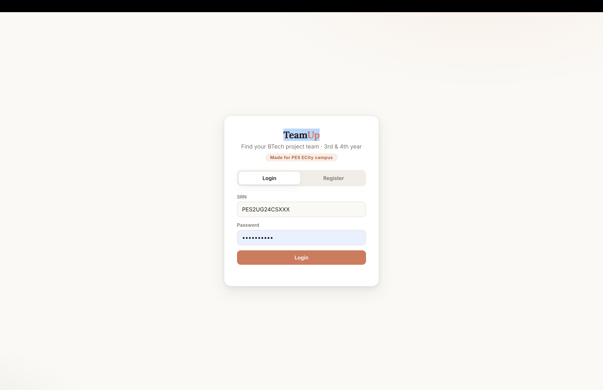
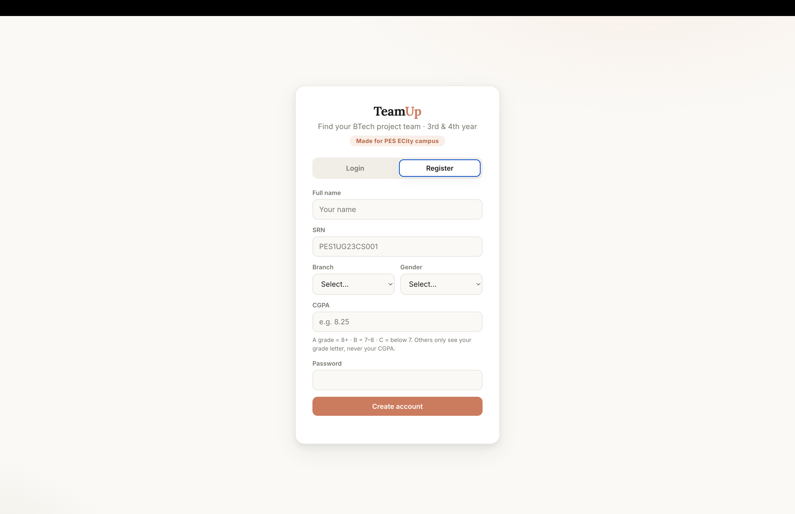
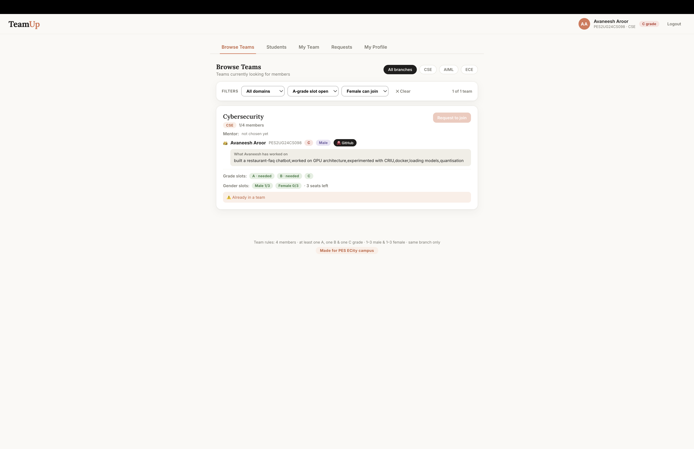
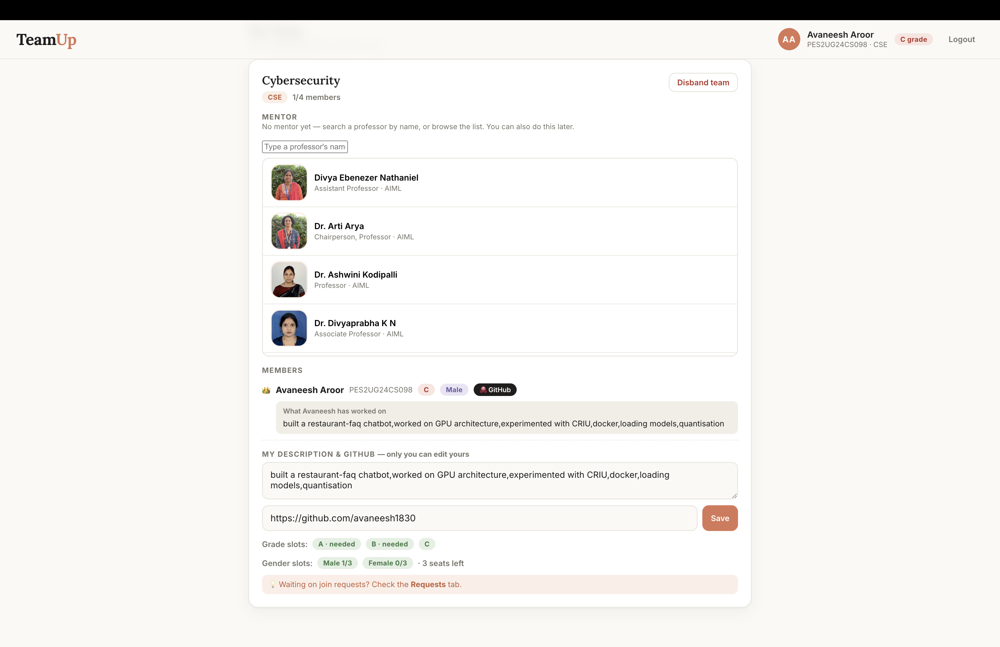
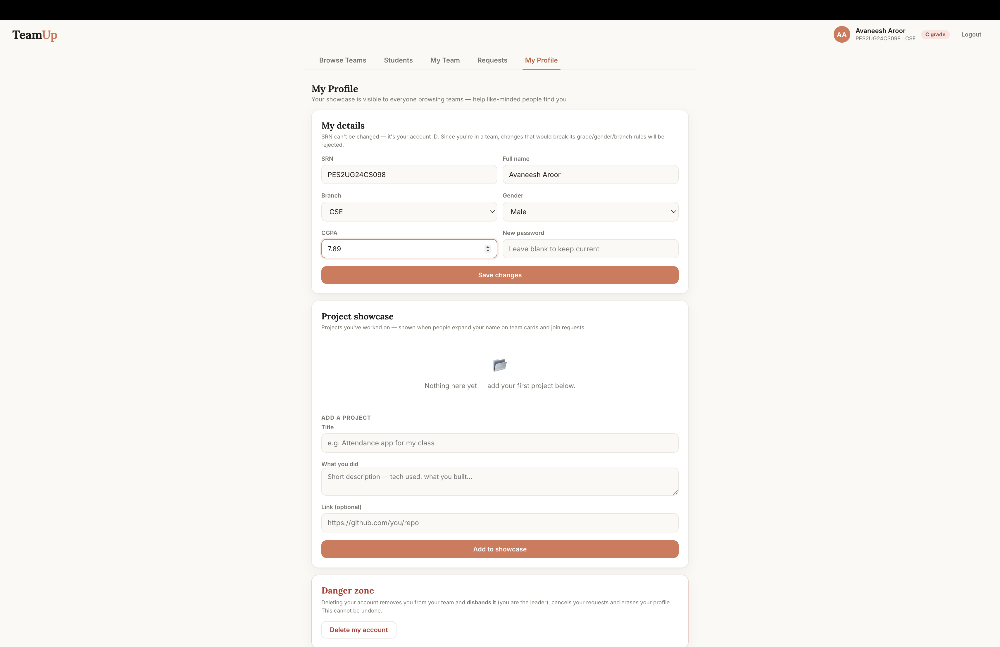

# TeamUp 🎓

**A team formation portal for BTech capstone projects — made for PES Electronic City campus.**

Every 3rd-year student needs a team of 4 for the two-year capstone project, and the
university has strict rules about who can team up with whom. Finding teammates over
WhatsApp is chaos — TeamUp replaces it with a clean portal where the rules are
enforced automatically and finding the *right* teammates is actually easy.

Built by [Avaneesh Aroor](https://github.com/avaneesh1830).

---

## Screenshots

| Login | Register |
|---|---|
|  |  |

| Browse Teams (with filters) | My Team (mentor picker) |
|---|---|
|  |  |

| My Profile |
|---|
|  |

---

## Features

### 🧩 Team formation with rules enforced automatically
- Teams of **exactly 4 members** — the system makes an invalid team impossible:
  - at least **one A (CGPA 8+), one B (7–8), and one C (<7)** grade member
    (the 4th seat can repeat any grade)
  - **1–3 male and 1–3 female** members
  - **same branch only** (CSE / AIML / ECE) — cross-branch joins are blocked with a clear error
- The team creator becomes **leader** 👑 and approves or rejects join requests
- Every team card shows exactly **which grade slots and gender slots are still open**,
  computed live (e.g. a team with two A-grades and two seats left reserves them for B and C)
- Rules are re-checked at accept time too, so stale requests can't sneak in

### 🔎 Finding the right teammates
- **Browse Teams** — every team with its members, open slots, and one-click join requests
- **Filters** — by branch, project domain, open grade slot, and open gender slot,
  with a live "3 of 7 teams" count
- **Student directory** — search any classmate by name or SRN, see whether they're
  available or already in a team, and **request to join their team right from the
  search result**; leaders also see instantly whether a searched student is eligible
  for their team
- **Project showcase** — every student can list projects they've worked on
  (title, description, link), expandable from any team card or join request
- **Personal GitHub** — each member's GitHub appears as a chip next to their name
- **Member introductions** — every team member writes their own "what I've worked on"
  blurb on the team page; the server only ever writes to the author's own entry,
  so nobody can edit anyone else's

### 🎯 Project domains
- Teams are organised around their **project domain** (AI/ML, Web Dev, IoT,
  Cybersecurity, Blockchain, …) — pick from a dropdown or type a custom one

### 👨‍🏫 Faculty mentors
- Leaders pick a mentor from the real **PES EC-campus faculty directory** —
  85 professors from CSE, AIML, and ECE with names, designations, and photos
- Searchable picker with large photos; mentor is displayed on the team's public card
- Can be chosen at creation time or any time later, and changed or removed

### 🔐 Privacy, accountability & safety
- **Exact CGPA is never shown to other students** — only the grade letter (A/B/C)
- Passwords stored with **salted scrypt hashing**; sessions via bearer tokens
- Students can **edit their own details** (with team-rule re-validation so an edit
  can't silently break an existing team) and **delete their account**
- Built-in **activity log** records every registration, team creation, join,
  leave, and disband with timestamps
- All user content is HTML-escaped; all links validated server-side

### ⚡ Built to handle the whole batch
- Load-tested with **1,000 students and 200 teams**: ~8ms per request,
  100 concurrent requests in 0.5s
- gzip compression (the teams payload shrinks ~12×)
- Crash-safe atomic writes — the database file can never be left half-written

---

## Tech stack

- **Backend:** Node.js + Express — a single ~500-line server, no external database
- **Storage:** JSON file (`data.json`), atomic writes, `DATA_DIR` env var for
  persistent volumes
- **Frontend:** vanilla HTML/CSS/JS — no framework, no build step
- **Faculty data:** scraped from [staff.pes.edu](https://staff.pes.edu/atoz/) into `professors.json`

## Run it locally

```bash
npm install
npm start
```

Open http://localhost:3000. Data lives in `data.json` (auto-created; delete to reset).

## Deployment

Needs any host with a persistent disk (it writes `data.json`):

- **College server / any Linux box:** `npm install && npm start`
  (set `PORT` and optionally `DATA_DIR`)
- **Railway:** deploy from this repo → add a volume mounted at `/data` →
  set env var `DATA_DIR=/data` → generate a domain
- ⚠️ Serverless hosts (Vercel, Netlify) won't work as-is — no persistent filesystem

---

<p align="center"><b>Made for PES ECity campus</b> 🧡</p>
